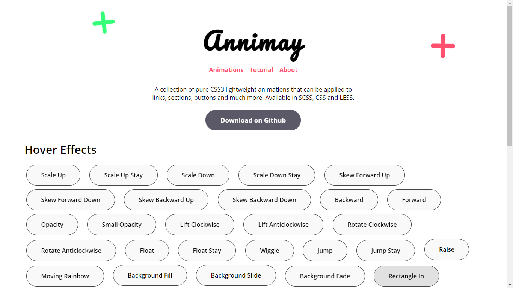

 # Annimay
> A collection of pure CSS3 lightweight animations that can be applied to links, sections, buttons and much more. Available in CSS and SCSS and compatible with all browsers except Internet Explorer.

[Demo](https://edumigueis.github.io/Annimay/)

 
This project consists of an extensive collections of simple css-powered animations, currently Annnimay has 52 hover animations and 12 infinite animations.

## Installation

You can just download the css files and use them in your project, either by linking or directly using the code. If you are not interested in using a lot of these annimations, they all have comments to name each one of them, so just look for the ones that suit your project best and use them(make sure to credit, that's truly appreciated). They can all be customized to infinite and beyond. Enjoy! :smile:

## Meta

Eduardo Migueis – [edumigueis](https://www.linkedin.com/in/edumigueis/)

Distributed under the MIT license. See `LICENSE` fore more information.

[https://github.com/edumigueis/Annimay](https://github.com/edumigueis/)

## Contributing

1. _fork_ the project (<https://github.com/edumigueis/Annimay/fork>)
2. Create a _branch_ for your modification (`git checkout -b feature/awesomeFeature`)
3. Do the _commit_ (`git commit -am 'Add something'`)
4. _Push_ (`git push origin feature/awesomeFeature`)
5. Create a new _Pull Request_
